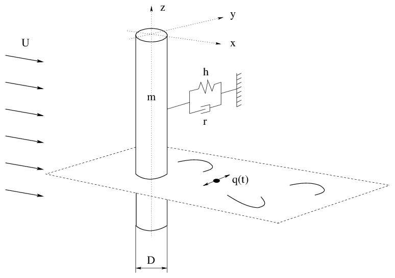

# SINDy_VIV
Sparse Identification of Non-Linear Dynamics (SINDy) is used to identify and discover non-linear dynamics of wake &amp; lift oscillator Vortex Induced Vibration (VIV) systems. 2 Reduced order VIV systems, namely, wake oscillator proposed by Fachinetti [1] (2003) &amp; an older model of lift oscillator proposed by Hartlen &amp; Curie [2] (1970) are studied. 

[1]Facchinetti, ML., Langre, E., Biolley, F., 2004, Coupling of structure and wake oscillators in vortex-induced vibrations, 123-140  
[2] Hartlen, R.T., Currie, I.G., 1970. Lift-oscillator model of vortex-induced vibration. Journal of the Engineering Mechanics Division EM5, 577–591.

