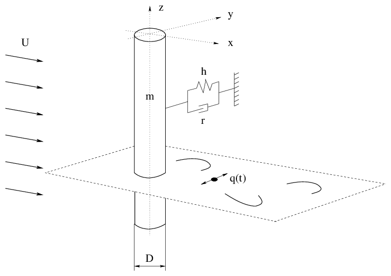

# SINDy_VIV

Sparse Identification of Nonlinear Dynamics (SINDy) is used in this project to discover governing equations for vortex-induced vibration (VIV) systems. This repository combines **classical reduced-order physics-based models** with **data-driven system identification**.


## Governing Equations

### 1. Wake Oscillator Model (Facchinetti et al.)

$$
y'' + \left(2\xi\delta + \frac{\gamma}{\mu}\right)y' + \delta^2 y = s \quad 
$$

$$
q'' + \epsilon(q^2 - 1)q' + q = f \quad 
$$

---

### 2. Lift Oscillator Model (Hartlen & Currie)

The system is:

$$
x_r'' + 2\zeta x_r' + x_r = a w_0^2 C_L 
$$

$$
C_L'' - a w_0 C_L' + \frac{\gamma}{w_0} (C_L')^3 + w_0^2 C_L = b x_r' 
$$

---
## Discovered Models (SINDy Results)

### 1. Wake Oscillator (from simulated data)

$$
(q)' = -0.0111 - 0.206q + 1.025u + 0.008U_r + 0.082qU_r - 0.013uU_r - 0.002U_r^2 + 0.002q^3 + 0.007q^2u - 0.009u^2 - 0.008qU_r^2 + 0.001uU_r^2
$$

$$

(u)' = -0.0241 + 2.845q - 4.848u + 0.016U_r - 1.223qU_r + 2.059uU_r - 0.003U_r^2 + 0.010q^3 - 0.162q^2u - 0.060qu^2 + 0.090qU_r^2 + 0.026u^3 - 0.209uU_r^2

$$


### 2. Lift Oscillator (from CFD data)

$$
(C_l)' = 0.239 \, p
$$

$$

(p)' = 0.169 + 0.119C_l + 1.536p - 0.088C_l^2 - 0.021C_l p - 0.064p^2 - 0.180C_l^3 - 0.769C_l^2 p - 0.180C_l p^2 - 0.766p^3
$$

where \( p = \dot{C}_l \)

* Lift coefficient (C_l) is obtained from CFD of a static cylinder
* Time-series data is used directly for system identification
* No explicit governing equations are assumed


---

## Physical Model



---

## Repository Structure

* `SINDy_wake_oscillator.ipynb` → Wake oscillator + SINDy identification
* `SINDy_lift_oscillator.ipynb` → Lift oscillator + SINDy identification
* `wake_oscillator_model.ipynb` → Base wake model
* `lift_oscillator.ipynb` → Base lift model
* `CFD_lift_drag_time_series_stable*` → CFD datasets

---

## Requirements

* Python 3.x
* NumPy
* SciPy
* Matplotlib
* PySINDy (optional but recommended)

```bash
pip install numpy scipy matplotlib pysindy
```

---

## How to Run

```bash
git clone https://github.com/<your-username>/SINDy_VIV.git
cd SINDy_VIV
jupyter notebook
```

Run:

* `SINDy_wake_oscillator.ipynb`
* `SINDy_lift_oscillator.ipynb`

---

## References

[1] Facchinetti, M.L., de Langre, E., Biolley, F. (2004)
*Coupling of structure and wake oscillators in vortex-induced vibrations*

[2] Hartlen, R.T., Currie, I.G. (1970)
*Lift-oscillator model of vortex-induced vibration*

---

